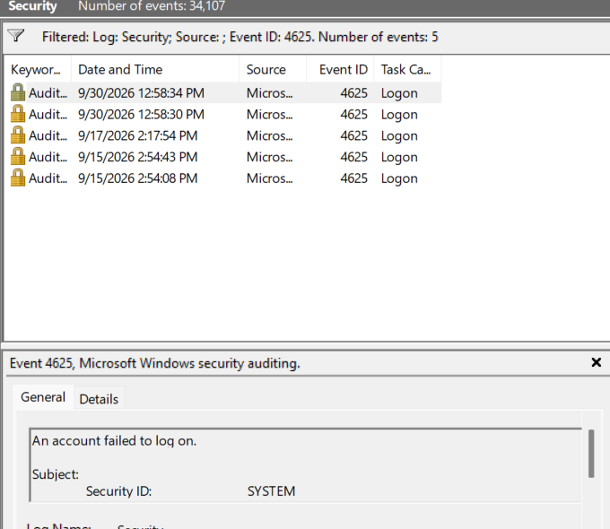
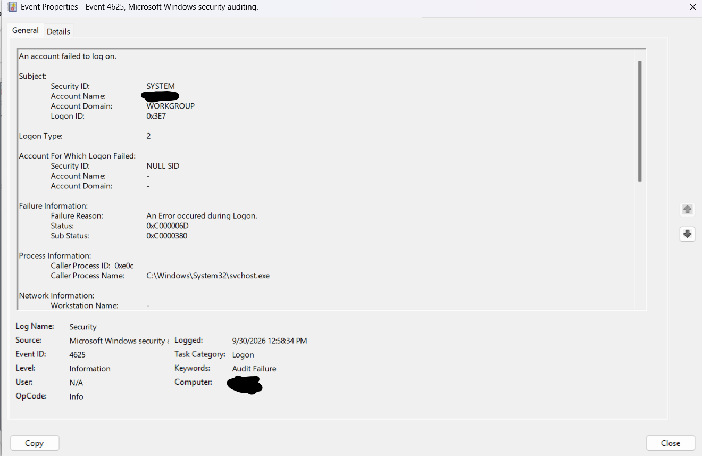
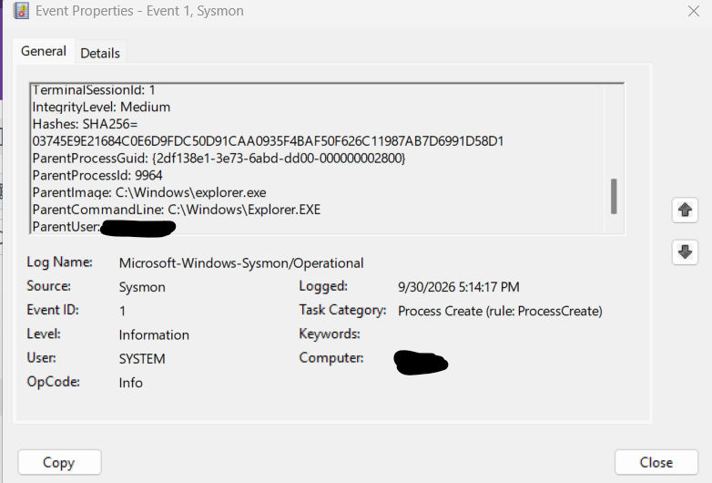
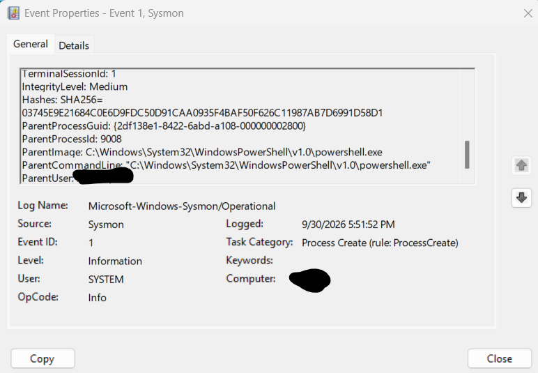
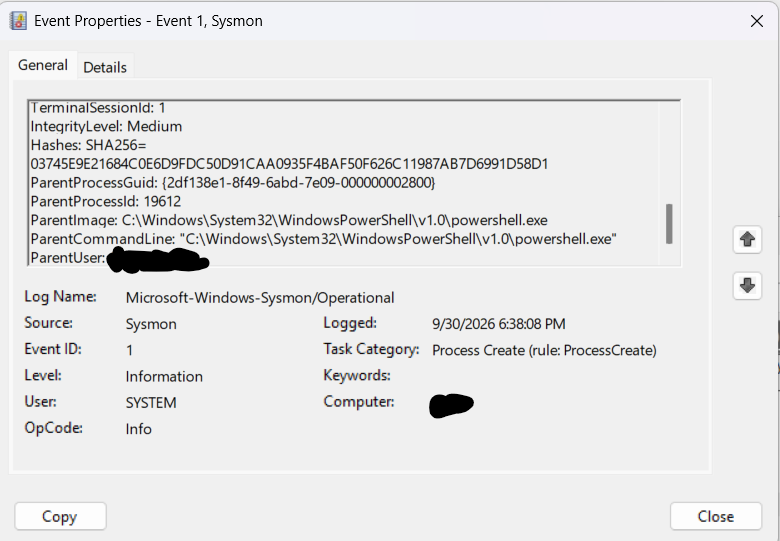

# Windows Failed Login Investigation

## Objective

Investigate failed Windows authentication activity using Windows Event Viewer.

## Tools Used

- Windows 11
- Windows Event Viewer

## Lab Setup

I generated controlled authentication failures on my personal Windows lab system and investigated the resulting Windows Security events.

## Event Investigated

Windows Security Event ID 4625 — failed account logon.

## Investigation

I filtered the Windows Security log for Event ID 4625 and identified multiple failed authentication events.

I examined:

- Timestamp
- Account information
- Logon type
- Failure reason
- Status and sub-status codes
- Process information
- Available network information

## Evidence

### Event ID 4625 Filtered Results

The Windows Security log was filtered for Event ID 4625, revealing multiple failed authentication events.

### Event ID 4625 Detailed Analysis

I examined an individual Event ID 4625 to review the logon type, failure information, status codes, process information, and available network information.

## Findings

One investigated event contained:

- Event ID: 4625
- Logon Type: 2
- Failure Reason: An Error occurred during Logon
- Status: 0xC000006D
- Sub Status: 0xC0000380
- Process: C:\Windows\System32\svchost.exe
- Result: Audit Failure

The event occurred during controlled testing within my lab environment.

## Conclusion

This project provided hands-on experience locating, filtering, and analyzing Windows authentication events.

I practiced identifying relevant event information and documenting the results of a basic security investigation.

## Skills Practiced

- Windows Event Viewer
- Windows Security Logs
- Event ID Analysis
- Authentication Failure Investigation
- Log Filtering
- Security Event Analysis
- Authentication monitoring
- Event log analysis
- Security event investigation
- Incident documentation

 ## Sysmon Process Investigation

I used Sysmon Event ID 1 process creation logs to investigate parent-child process relationships on my Windows lab system.

### Process Analysis

I reviewed Sysmon Event ID 1 logs to identify which parent processes were responsible for starting other processes.

During the investigation, I observed normal process activity where Windows Explorer (explorer.exe) acted as the parent process for Notepad.

I also generated a controlled test where PowerShell launched Notepad. Sysmon recorded powershell.exe as the parent process, demonstrating how process creation logs can be used to trace application execution.

### Analysis

Sysmon Event ID 1 records process creation activity and provides information about both the newly created process and its parent process.

By comparing the parent process information, I was able to distinguish normal application execution from the controlled PowerShell test. This demonstrates how process relationships can provide useful context when investigating potentially suspicious activity.

### Findings

- Sysmon Event ID 1 successfully captured process creation activity.
- Normal Notepad execution showed explorer.exe as the parent process.
- In the controlled PowerShell test, powershell.exe was identified as the parent process of notepad.exe.
- Parent-child process relationships can help identify unusual or potentially suspicious process execution.
