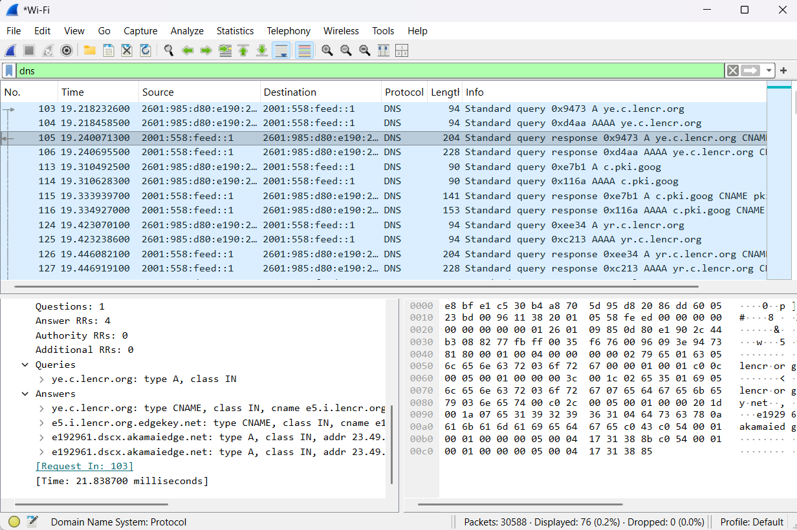
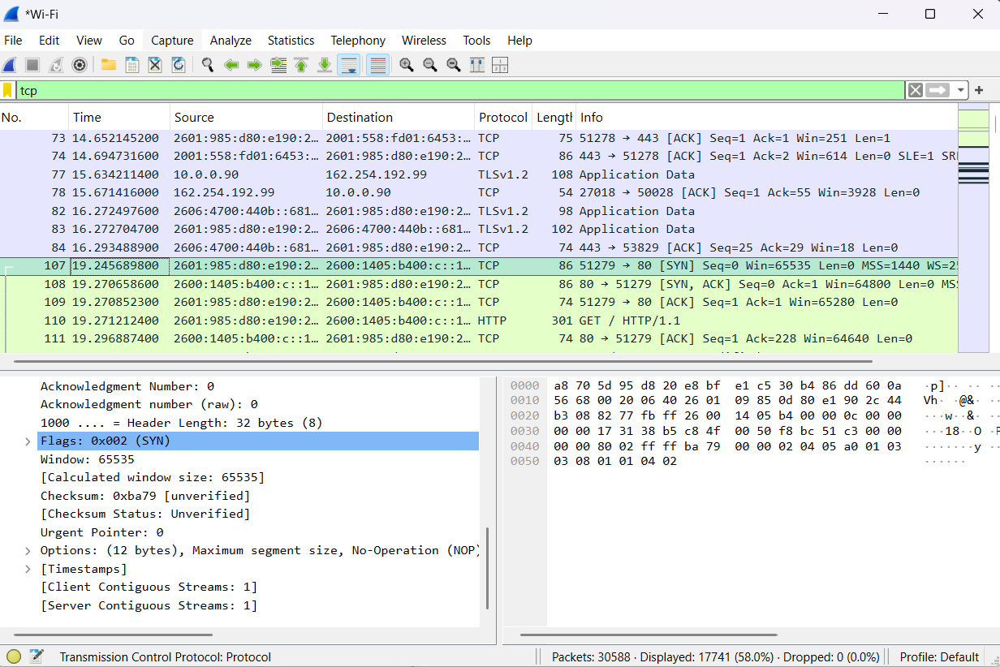
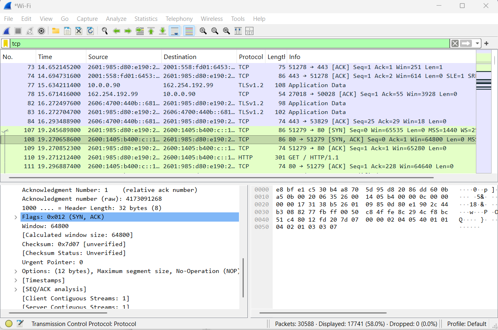
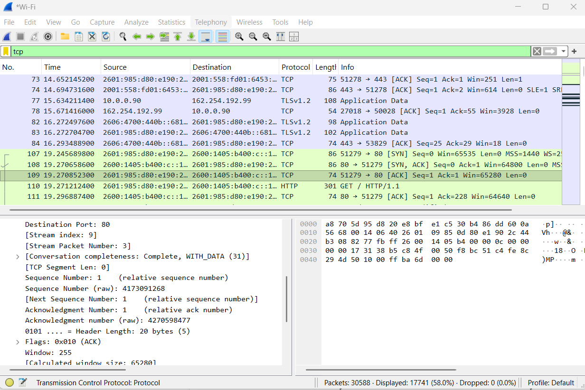
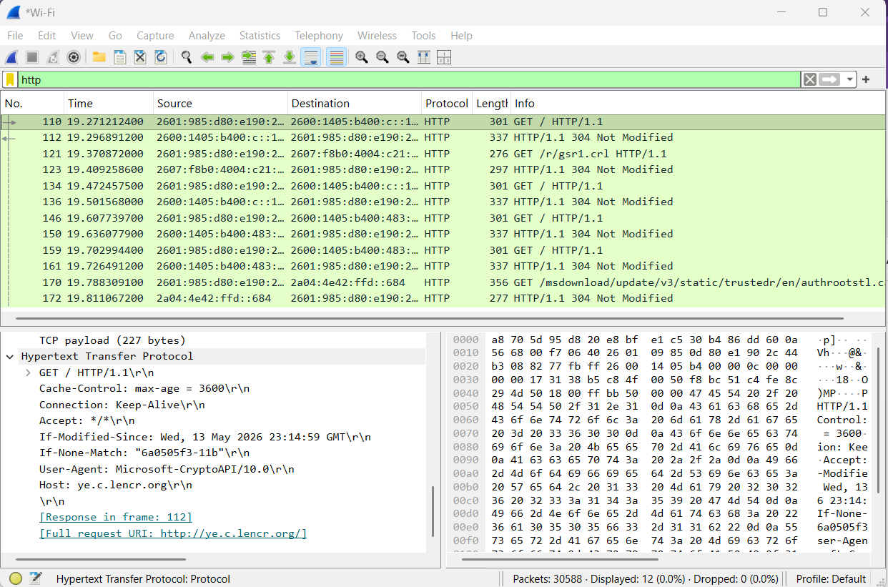

# Wireshark Network Traffic Analysis

## Objective

Capture and analyze network traffic using Wireshark to understand common network protocols and identify how devices communicate across a network.

## Tools Used

- Wireshark
- Windows 11
- Wi-Fi network interface

## Analysis

I captured live network traffic from my Windows system and used Wireshark display filters to investigate DNS, TCP, HTTP, and TLS traffic.

### DNS Analysis

I filtered network traffic using the `dns` display filter and examined DNS query and response packets. This demonstrated how DNS is used to resolve domain names to IP addresses.

### TCP Three-Way Handshake

I filtered traffic using the `tcp` display filter and identified the three packets involved in a TCP three-way handshake:

1. SYN
2. SYN-ACK
3. ACK

This demonstrated how a TCP connection is established between two systems.

### HTTP Analysis

I filtered traffic using the `http` display filter and examined an HTTP GET request. The packet details showed information such as the request method, host, and request URI.

### TLS Analysis

I filtered traffic using the `tls` display filter and examined TLS application data. Unlike the HTTP traffic, the application data was encrypted and its contents were not readable directly in the packet capture.

## Findings

- DNS traffic showed how domain-name resolution occurs.
- TCP traffic demonstrated the SYN, SYN-ACK, and ACK connection-establishment process.
- HTTP traffic allowed request information to be viewed in plaintext.
- TLS traffic demonstrated how application data can be encrypted during network communication.
- Wireshark display filters helped isolate specific protocols for investigation.

## Skills Practiced

- Network traffic analysis
- Packet analysis
- Wireshark display filtering
- DNS analysis
- TCP/IP analysis
- TCP three-way handshake analysis
- HTTP traffic analysis
- TLS traffic analysis
- Network troubleshooting
- Security investigation
